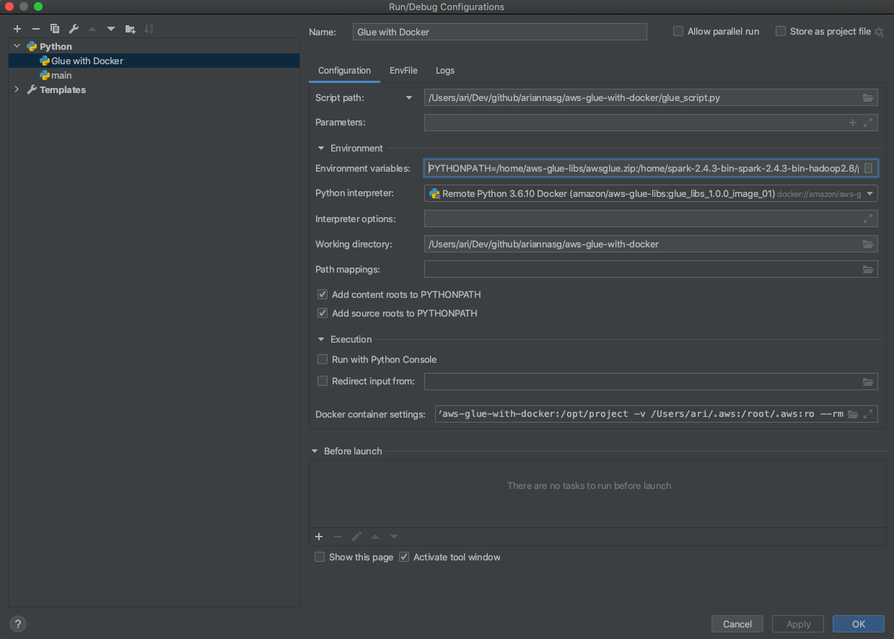
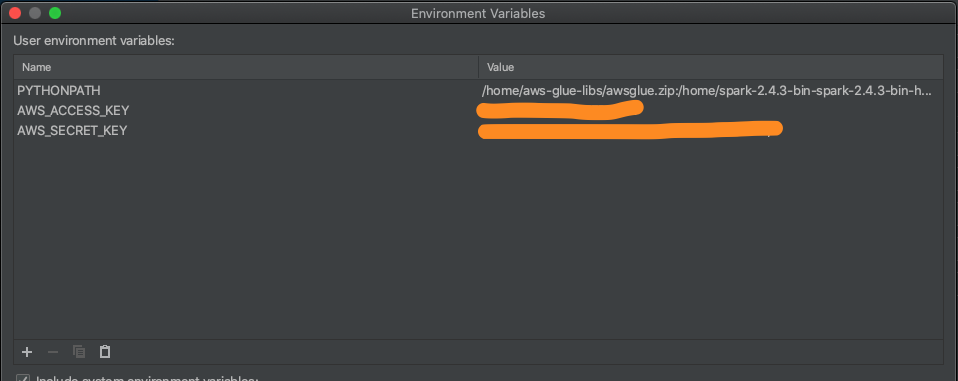
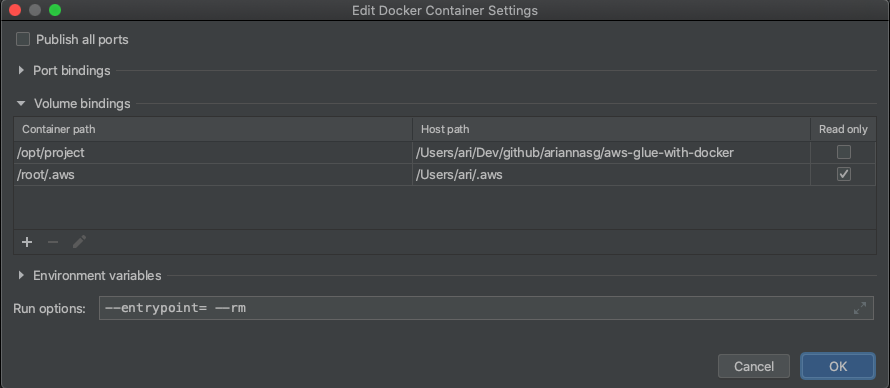
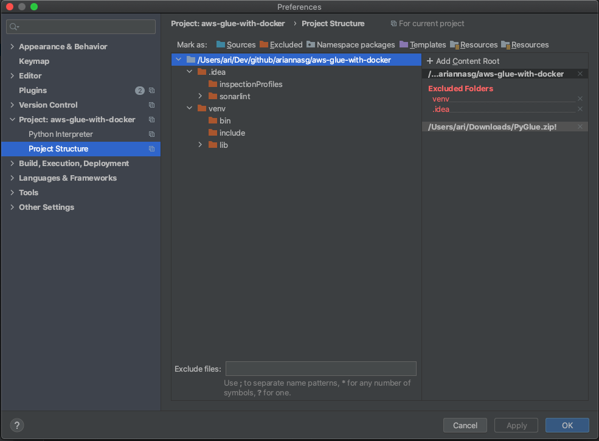
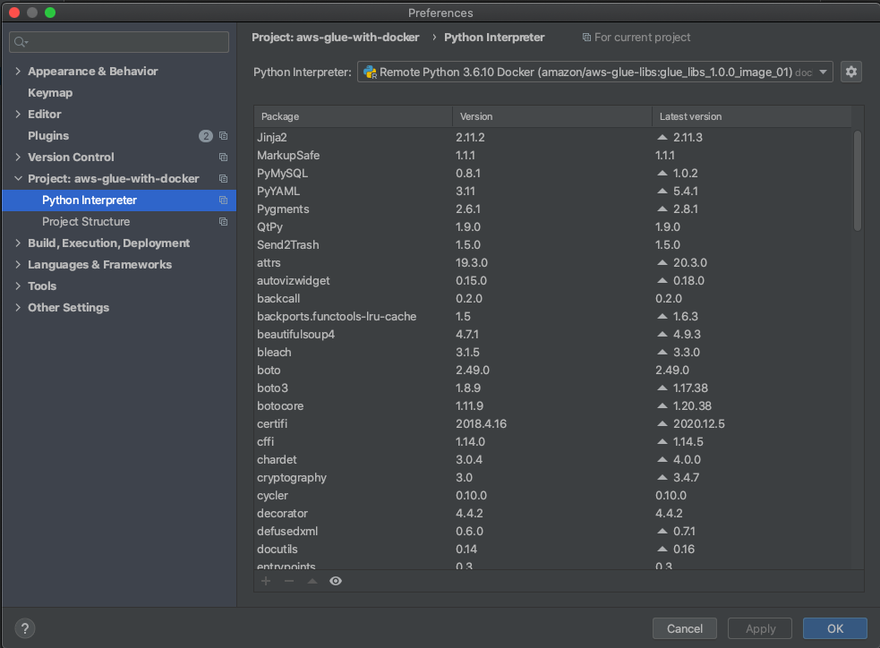

[](LICENSE.md)

# Developing AWS Glue ETL jobs locally using a container

* [Description](#description)
* [Local setup](#local-setup)
* [License](#license)

## Description
Implementation of https://aws.amazon.com/blogs/big-data/developing-aws-glue-etl-jobs-locally-using-a-container/

Notes: It's really slow to run this in PyCharm - screen freezes often.

## Objectives
Description of project objectives.

## Local setup
Follow the instructions in the link above.

Useful command:
```bash
docker run -itd -p 8888:8888 -p 4040:4040 -v ~/.aws:/root/.aws:ro --name glue_jupyter amazon/aws-glue-libs:glue_libs_1.0.0_image_01 /home/jupyter/jupyter_start.sh
docker exec -it glue_jupyter bash
cat root/.aws/config
cat root/.aws/credentials
```

The user needs this policy:
```json
{
    "Version": "2012-10-17",
    "Statement": [
        {
            "Sid": "GlueAccess",
            "Effect": "Allow",
            "Action": [
                "glue:GetDatabase",
                "glue:GetDatabases"
            ],
            "Resource": [
                "arn:aws:glue:<region>:<account_number>:database/*",
                "arn:aws:glue:<region>:<account_number>:catalog"
            ]
        }
    ]
}
```








## License
This project is licensed under the terms of the MIT License.
Please see [LICENSE](LICENSE.md) for details.

